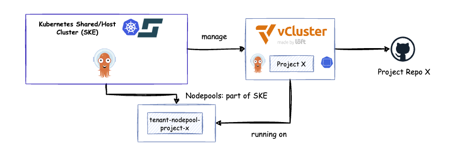
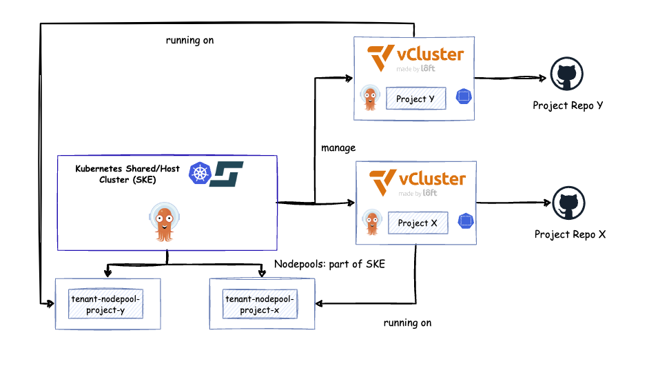

# 0. Preparation

__NOTE:__ If you missed the webinar, you can watch it here [Watch the Webinar](https://www.youtube.com/watch?v=7p1GdyS7kmA) and if you missed the Blog you can read it here [How to Build a Multi-Tenancy Internal Developer Platform with GitOps and vCluster](https://itnext.io/how-to-build-a-multi-tenancy-internal-developer-platform-with-gitops-and-vcluster-d8f43bfb9c3d)


This section covers the necessary steps to prepare the environment if you want to run the demo **1:1** on your own.
If not, feel free to skip this part and jump directly to the **[Demo section](#templater)**.


## STACKIT Kubernetes Engine (SKE)

To proceed, you’ll need access to the **STACKIT Portal** to create your Kubernetes cluster.
Alternatively, you can use any service provider of your choice, as long as you configure the following:

- **Node pools**
- **Labels**
- **Taints**

If you’re interested in using **STACKIT Kubernetes Engine (SKE)**, you can find detailed instructions on setting up the provider **[here](https://registry.terraform.io/providers/SchwarzIT/stackit/latest/docs)**.


## Templater

The **Templater** is a simple 🐍 **Python-based tool** with schema validation. It uses a `config.yaml` file to automatically generate the necessary resources for your setup.
For more details, check out the documentation in the **[templater](tools/templater/README.md)**.


Now, let’s jump into the demo and get things started! 🚀

# 1. Demo - Current Setup

- **1 x Managed Kubernetes Cluster** based on [STACKIT Kubernetes Engine (SKE)](https://www.stackit.de/en/product/kubernetes/)
- **1 x Running Argo CD** for GitOps
- **1 x Running vCluster** for project-x

**Request:** Developer Needs a New vCluster or Stage for project-z




## 1. Modify the `config.yaml`
Change the configuration from:

```yaml
clusters:
  - project: project-x
    nodePools:
      - name: "workload"
```

To:

```yaml
clusters:
  - project: project-x
    nodePools:
      - name: "workload"
  - project: project-z
    nodePools:
      - name: "workload"
```


## 2. Generate the New Manifest Using the Custom Python Templater
Run the templater with the following command:

```bash
igor

config-template --all
```


## 3. Apply Changes with Terraform
Initialize and run Terraform to create the node pool for project-z:

```bash
terraform init
terraform plan --var-file=terraform.tfvars
terraform apply --var-file=terraform.tfvars
```


## 4. Commit the Generated Application to the Git Repository
Ensure the newly created vCluster configuration is tracked and pushed:

```bash
git add .
git commit -m "Add vCluster for project-z"
git push
```


## 5. Connect to the New vCluster and Retrieve the Kubeconfig
Use the following command to log in and fetch the kubeconfig:

```bash
vcluster connect vcluster -n vcluster-project-z --server=https://192.214.176.XXX --insecure --kube-config-context-name project-z
```

## 6.  Login via Argo CD CLI

```bash
kubectl port-forward svc/argocd-server -n argocd 8080:443

argocd login localhost:8080  \
  --username admin   \
  --password $(kubectl -n argocd get secret argocd-initial-admin-secret -o jsonpath="{.data.password}" | base64 -d; echo) \
  --insecure
```

## 7. Register the New vCluster with Argo CD and Label It for Deployment
Add the vCluster to Argo CD and apply the appropriate label for application deployment:

```bash
argocd cluster add project-z --label env=vdev --upsert
```





# 2. Cleanup


- Remove `project-z` from the `config.yaml`.
- Use the `config-template` to delete all related manifests.
- Commit the changes to the Git repository.
- Run `terraform destroy` to remove the node pool.
- Delete the `secreto` for vCluster from the Argo CD namespace.


# 3. Outlook and Work in Progress (WIP)

- Implement GitHub Actions for the CI/CD pipeline.
- Extend the setup with **External-DNS**, secrets management, etc.
- Transition from the pipeline approach to an **Open Application Model (OAM)** and adopt a composable architecture using **Crossplane** or **Kro.run**.
- Integrate the solution into a portal, such as **getport.io**, or use a framework like **Backstage** to build a developer platform.
